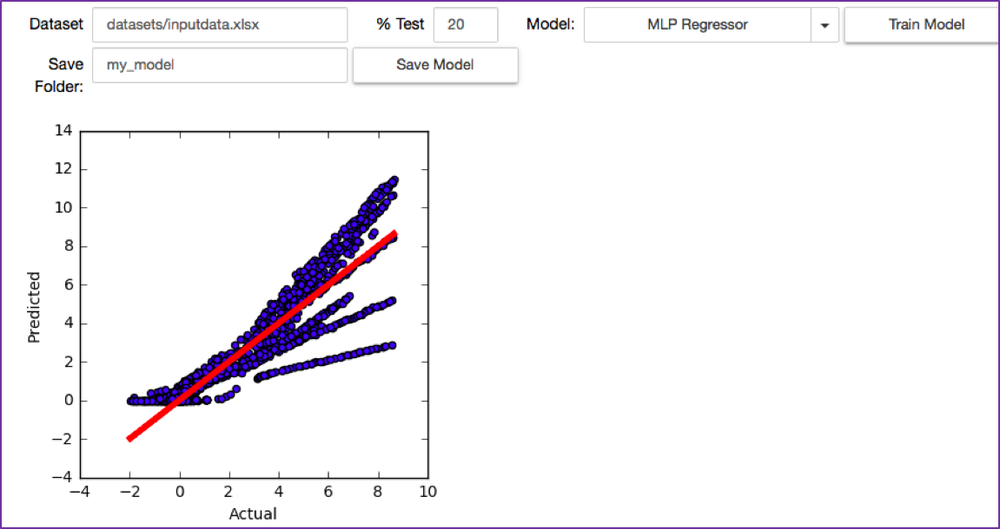
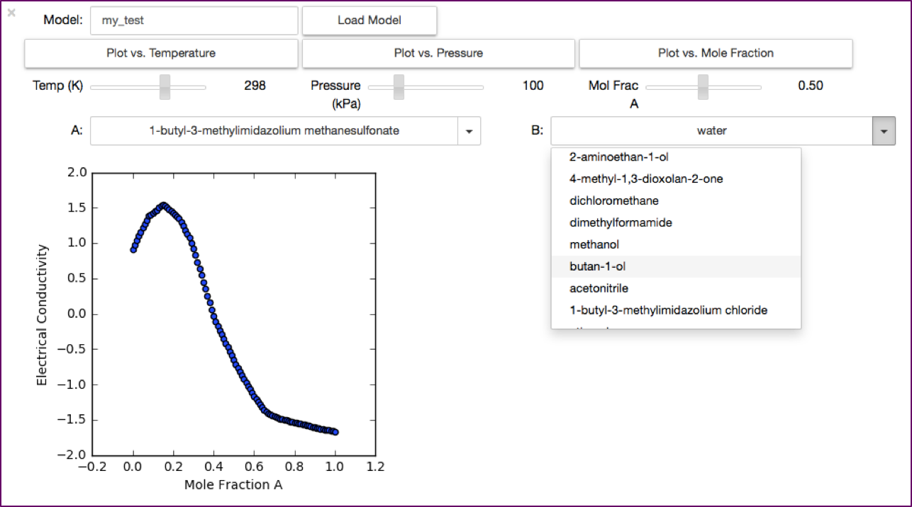

# ILest: Ionic Liquids Estimation
UW DIRECT Project on Ionic Liquids Machine Learning. The package contains
tools and wrappers of existing Python infrastructure for data analysis
(http://pandas.pydata.org/) and (http://scikit-learn.org/stable/) for the
purpose of estimating desired properties of ionic liquid binary mixtures.

## Contributors
Joseph Kasper, Hongbin Liu, Moke Mao, Sarah Floris

## Documentation
See the examples directory

## License
This software is released under the MIT license since
it is a permissive free software license that 
has excellent compatibility with other licenses. See the LICENSE
file for more information.

## Code Structure
```
|---ionic_liquid (master)
    |---ionic_liquid
        |---__init__.py
        |---version.py
        |---main.py
        |---util.py
        |---datasets
            |---compoundSMILES.xlsx
            |---compounddata.xlsx
        |---examples
            |---
        |---method
            |---__init__.py
            |---method.py
        |---visualization
            |---__init__.py
            |---core.py
            |---plot.py
        |---test
            |---test_utils.py
            |---test_method.py
            |---test_utils.py
        |Interface.ipynb
    |---doc
        |---overview.md
        |---functional_spec.md
        |---code_struct.md
        |---tutorial.md
        |---runcell.png
        |---model_train.png
        |---model_read.png
    |---README.md
    |---LICENSE
    |---setup.py
```
## Directory Summary
- `datasets` contains the downloaded ionic liquids data.

- `methods` contains the regression model used in this work.

- `visualization` contains the plot function.

- `test` is the folder for unit test.

- `Interface.ipynb` is a portable entrance of the interface widgets.

- `doc` contains documents, *tutorial* is also available in this directory.

- `LICENSE` MIT license

## Graphic User Interface (GUI)





