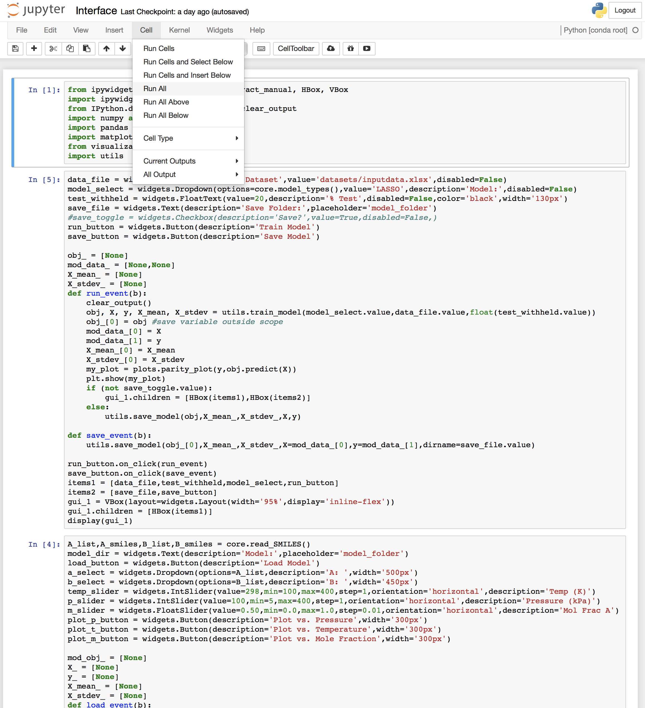

# Tutorial

This tutorial is based on the `Interface.ipynb` file in the `ionic_liquids/ionic_liquids/example` directory.

This tutorial will describe the interface and show how it works.

To run the interface, the workflow is:

1. Go to `ionic_liquids/ionic_liquids/example` directory.
`$ cd ../ionic_liquids/example`

2. Open the `Interface.ipynb` with `jupyter notebook`
`$ jupyter notebook`

3. Run all the cells in the notebook

4. Now you can see the widgets appear on the interface. Enter the dataset directory, choose the test data size and regression model, click the *Train Model* button.

5. After training, you should get a parity plot as shown above, you can save your model for future usage by click *Save Model* button.

6. You can load the trained model by enter the name and click *Load Model* button.

7. You can slide the Temperature and Pressure and change the A and B component. You will get a prediction of the electrical conductivity with a range of mole fraction of A component.
